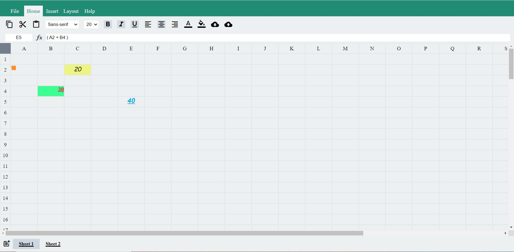
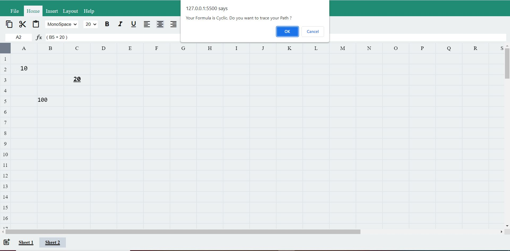
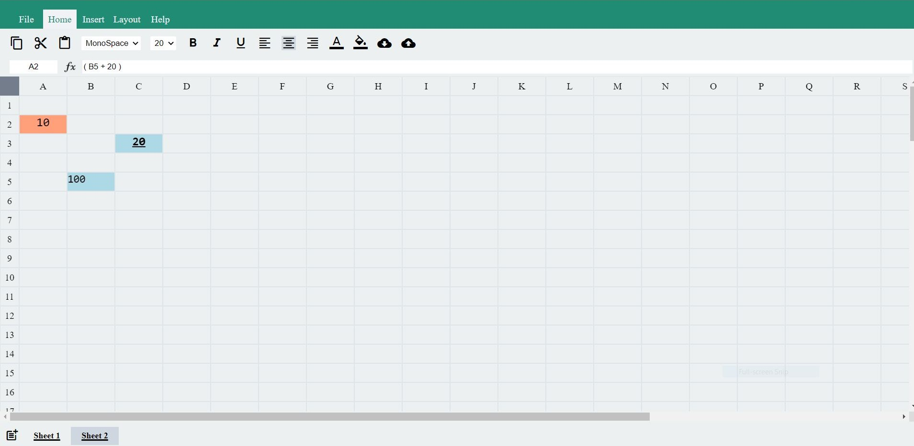
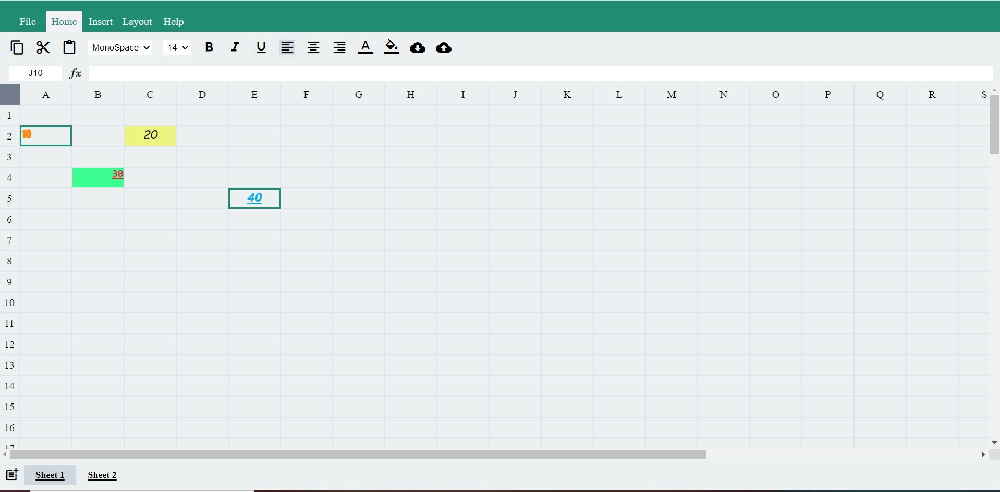

# Excel-Clone

## Description
### Build a Excel Clone with features :- 
- Properties Like Bold, Italic, underLine, TextColor, BGColor, etc
can be applied to each cell (Two-Way Binding).
- Formula evalutaion In Case the formula detects the cycle, an alert message will pop - up. Implemented cycle detection algorithm using DFS to detect the cycle. (Graph Algo Implemented).
- Cyclic Path Can Be Traced using certain colors.
- Multiple Sheet Can be added as well as Removed.
- Can Cut, Copy & Paste Values in a range of cells.
- Can Download as well as upload sheets. 

## See Live Demo

### visit --> https://my-excel.netlify.app/

## Screenshots

## Technologies Stack:

- HTML
- CSS
- Javascript

### Insights
- 2D Array of objects is used for storing cells and sheets data.
- Cycle Detection in formula is detected by using dfs.
- Google Material Icons is used.
- Various DOM events such as click, blur, etc are used.

### How to install
- Clone the project onto your local machine.
- Open index.html file in browser.
- That's it now your own excel is ready for use.
